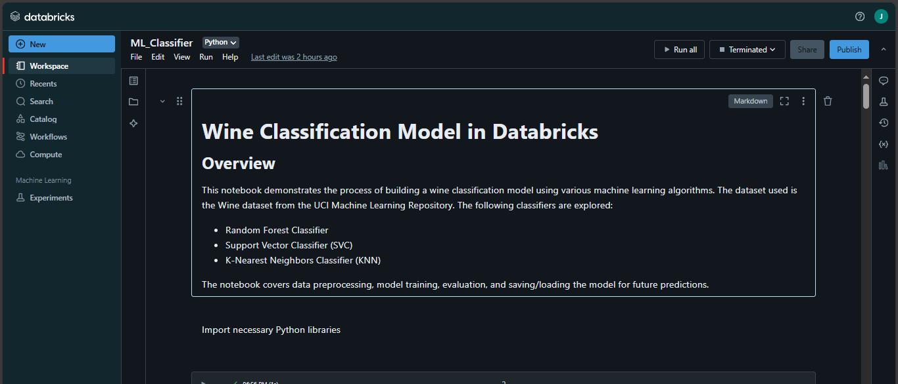
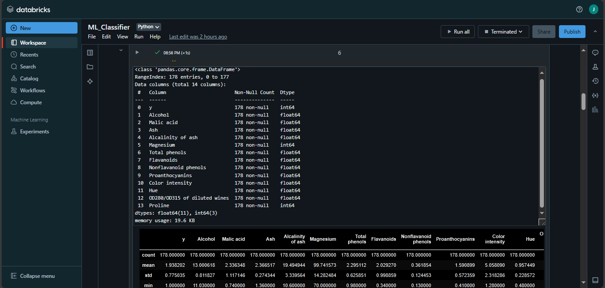
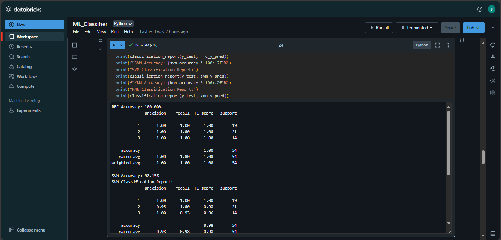
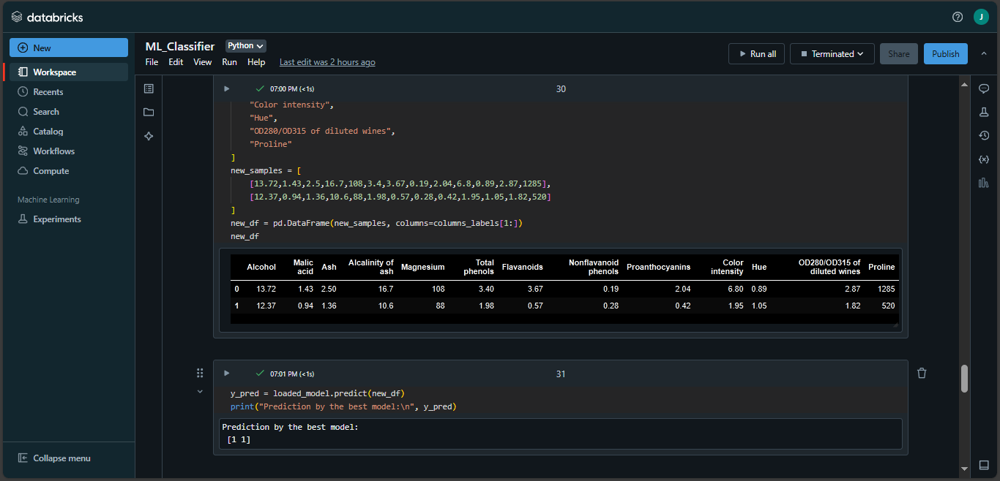

# Wine Classification Model in Databricks

## Overview

This notebook demonstrates the process of building a wine classification model using various machine learning algorithms. The dataset used is the Wine dataset from the UCI Machine Learning Repository. The following classifiers are explored:

- Random Forest Classifier
- Support Vector Classifier (SVC)
- K-Nearest Neighbors Classifier (KNN)

The notebook covers data preprocessing, model training, evaluation, and saving/loading the model for future predictions.



## 1. Importing Libraries

We begin by importing the necessary libraries for data manipulation, model training, and evaluation.

```python
import pandas as pd
from sklearn.model_selection import train_test_split
from sklearn.metrics import accuracy_score, classification_report
from sklearn.preprocessing import StandardScaler
from sklearn.ensemble import RandomForestClassifier
from sklearn.svm import SVC
from sklearn.neighbors import KNeighborsClassifier
import joblib
```

## 2. Loading the Dataset

The dataset is loaded directly from the UCI repository. The dataset contains 13 features and a target variable representing the class of wine.

```python
url = "https://archive.ics.uci.edu/ml/machine-learning-databases/wine/wine.data"
df = pd.read_csv(url, delimiter=',', header=None)
columns_labels = [
    "y", "Alcohol", "Malic acid", "Ash", "Alcalinity of ash", "Magnesium",
    "Total phenols", "Flavanoids", "Nonflavanoid phenols", "Proanthocyanins",
    "Color intensity", "Hue", "OD280/OD315 of diluted wines", "Proline"
]
df.columns = columns_labels
```

## 3. Data Exploration

Basic exploration of the dataset is performed using `info()` and `describe()` methods to understand the structure and summary statistics of the data.

```python
df.info()
df.describe()
```



## 4. Data Preprocessing

### 4.1 Splitting Labels from Features

The target variable `y` is separated from the features.

```python
Y = df["y"]
X = df[columns_labels[1:]]
```

### 4.2 Handling Missing Values

Missing values in the features are replaced with the mean of the respective columns.

```python
X = X.apply(lambda x: x.fillna(x.mean()), axis=0)
```

### 4.3 Data Standardization

Features are standardized using `StandardScaler` to have a mean of 0 and a standard deviation of 1.

```python
scaler = StandardScaler()
X = pd.DataFrame(scaler.fit_transform(X), columns=X.columns)
```

## 5. Splitting Data into Train and Test Sets

The dataset is split into training (70%) and testing (30%) sets.

```python
X_train, X_test, y_train, y_test = train_test_split(X, Y, test_size=0.3, random_state=42)
```

## 6. Model Training

Three different classifiers are trained on the training data:

### 6.1 Random Forest Classifier

```python
RFC_model = RandomForestClassifier(n_estimators=100, random_state=42)
RFC_model.fit(X_train, y_train)
```

### 6.2 Support Vector Classifier

```python
svm_model = SVC(kernel='rbf', random_state=42)
svm_model.fit(X_train, y_train)
```

### 6.3 K-Nearest Neighbors Classifier

```python
knn_model = KNeighborsClassifier(n_neighbors=5)
knn_model.fit(X_train, y_train)
```

## 7. Model Evaluation

The accuracy and classification report for each model are computed and displayed.

```python
rfc_y_pred = RFC_model.predict(X_test)
rfc_accuracy = accuracy_score(y_test, rfc_y_pred)

svm_y_pred = svm_model.predict(X_test)
svm_accuracy = accuracy_score(y_test, svm_y_pred)

knn_y_pred = knn_model.predict(X_test)
knn_accuracy = accuracy_score(y_test, knn_y_pred)

print(f"RFC Accuracy: {rfc_accuracy * 100:.2f}%")
print(classification_report(y_test, rfc_y_pred))
print(f"SVM Accuracy: {svm_accuracy * 100:.2f}%")
print("SVM Classification Report:")
print(classification_report(y_test, svm_y_pred))
print(f"KNN Accuracy: {knn_accuracy * 100:.2f}%")
print("KNN Classification Report:")
print(classification_report(y_test, knn_y_pred))
```



## 8. Saving and Loading the Best Model

The best-performing model (in this case, the Random Forest Classifier) is saved to disk using `joblib` and then reloaded to make predictions on new data.

### 8.1 Saving the Model

```python
joblib.dump(RFC_model, "/wine_quality_model.pkl")
```

### 8.2 Loading the Model

```python
loaded_model = joblib.load("/wine_quality_model.pkl")
```

## 9. Making Predictions with the Trained Model

The loaded model is used to predict the class of new wine samples.

```python
new_samples = [
    [13.72,1.43,2.5,16.7,108,3.4,3.67,0.19,2.04,6.8,0.89,2.87,1285],
    [12.37,0.94,1.36,10.6,88,1.98,0.57,0.28,0.42,1.95,1.05,1.82,520]
]
new_df = pd.DataFrame(new_samples, columns=columns_labels[1:])
y_pred = loaded_model.predict(new_df)
print("Prediction by the best model:\n", y_pred)
```

